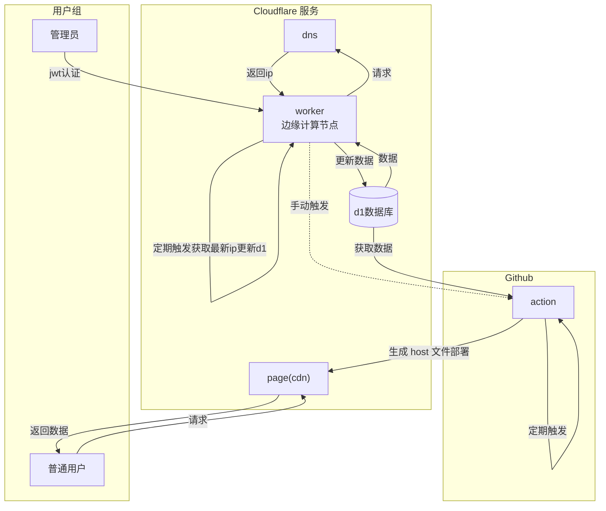

# 项目架构

```mermaid
flowchart TB
    subgraph Cloudflare 服务
    cdn["page(cdn)"]
    dns[dns]
    worker["worker
    边缘计算节点"]
    d1[d1数据库]@{shape: cyl}
    end
    subgraph Github
    github[action]
    end
    subgraph 用户组
    user[普通用户]
    admin["管理员"]
    end
    d1 --数据--> worker
    github --生成 host 文件部署--> cdn
    github --定期触发--> github
    worker -.手动触发.-> github
    worker --请求--> dns
    dns --返回ip--> worker
    worker --更新数据--> d1
    user --请求--> cdn
    cdn --返回数据--> user
    d1 --获取数据--> github
    admin --jwt认证--> worker
    worker --定期触发获取最新ip更新d1--> worker
```
