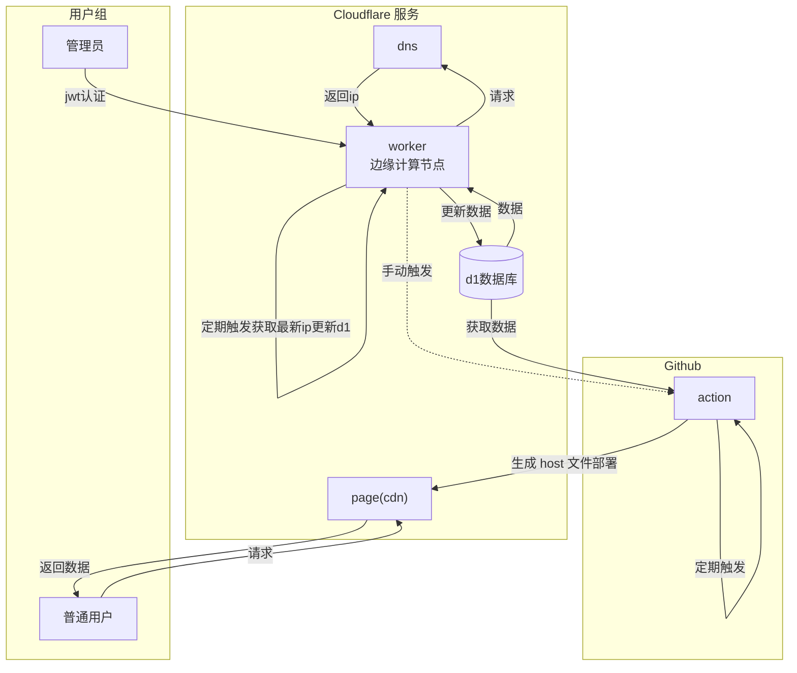

# 私有化部署

你需要先准备一个 `cloudflare` 和一个 `github` 账号

## 项目原理

## 目录结构

- apps (应用目录)
  - api (cloudflare worker 代码)
  - cdn (cdn 静态资源, 用来部署 host 文件)
  - docs (本文档，可忽略)
  - mgmt (管理后台，可忽略)

## 部署

简单点说就是，直接 `fork` 这个项目，然后填充环境变量，即可部署

其中你只需要在 `Cloudflare` 上创建对应的 `Pages` 资源即可

其余的部分可交给 `wrangler` 进行处理和部署
