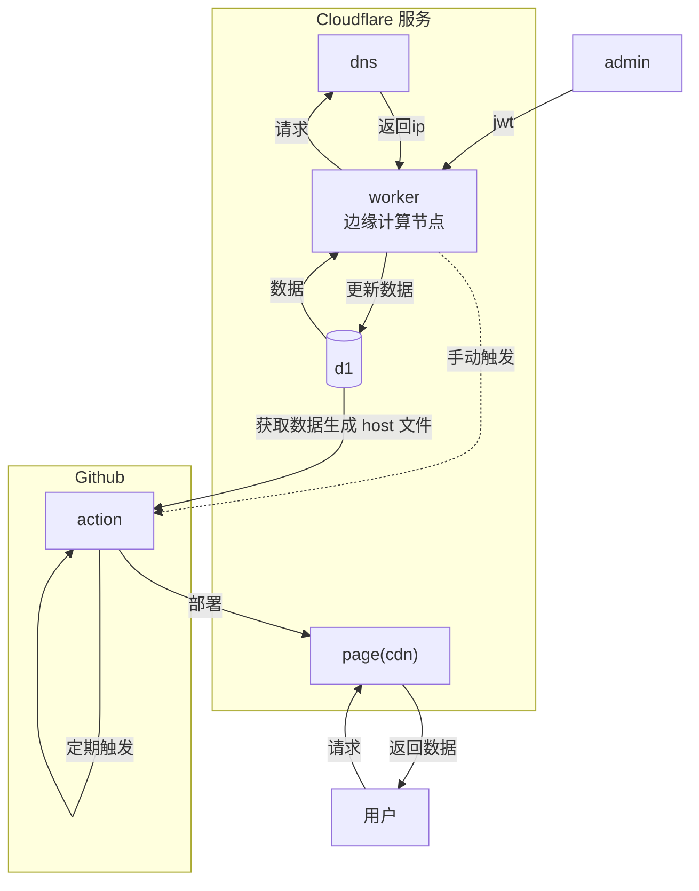

# 私有化部署

你需要先准备一个 `cloudflare` 和一个 `github` 账号

## 项目原理

```mermaid
flowchart TB
    subgraph Cloudflare 服务
    cdn["page(cdn)"]
    dns[dns]
    worker["worker
    边缘计算节点"]
    d1[d1]@{shape: cyl}
    end
    subgraph Github
    github[action]
    end
    d1 --数据--> worker
    github --部署--> cdn
    github --定期触发--> github
    worker -.手动触发.-> github
    worker --请求--> dns
    dns --返回ip--> worker
    worker --更新数据--> d1
    user[用户] --请求--> cdn
    cdn --返回数据--> user
    d1 --获取数据生成 host 文件--> github
    admin --jwt--> worker
```

## 问题

为什么不直接使用 `cloudflare worker` 来返回 `host` 呢？

因为 `cloudflare worker` 每天有限制请求的次数，可能会被击穿

所以不如使用 `cloudflare page` 然后动态生成 `host` 再同步到全世界
